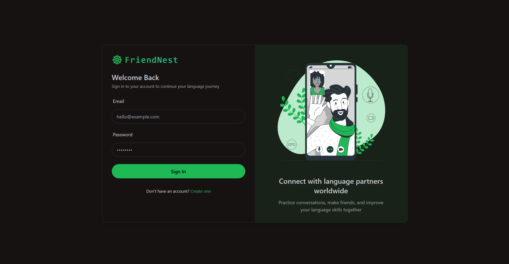
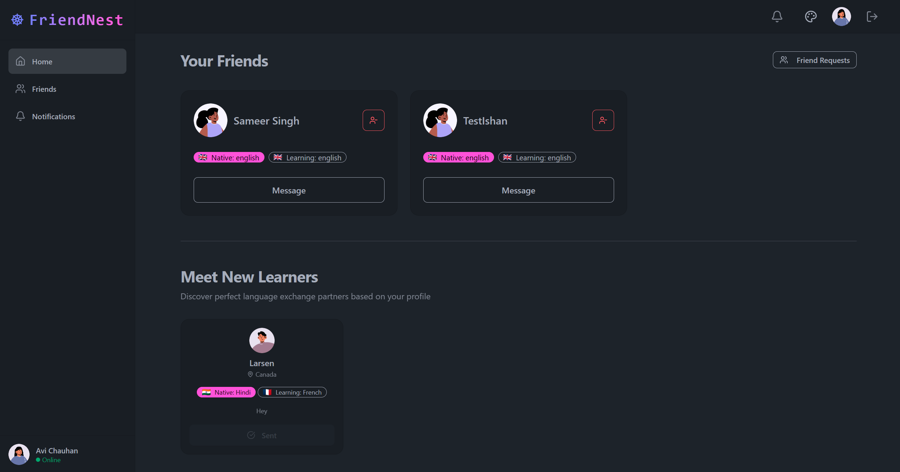
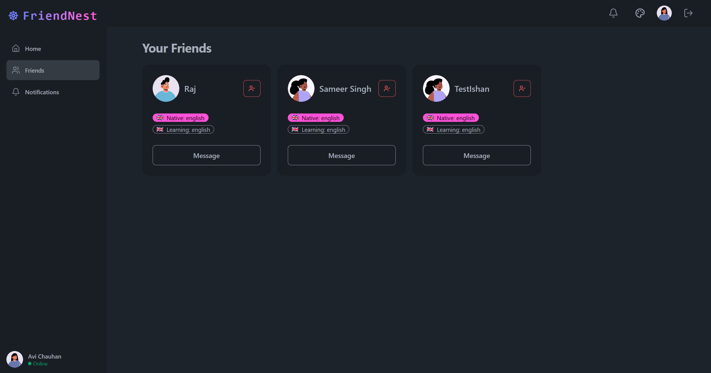
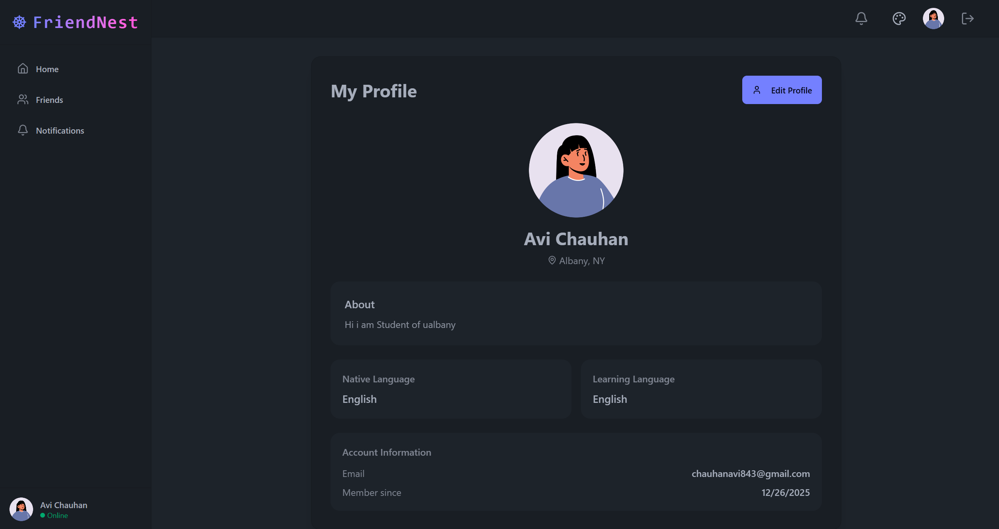

# FriendNest

<div align="center">
  


**A modern social platform for connecting with language exchange partners through real-time chat and video calling**

[](https://reactjs.org/)
[](https://nodejs.org/)
[](https://www.mongodb.com/)
[](https://getstream.io/)

</div>

---

## 📋 Table of Contents

- [Features](#-features)
- [Tech Stack](#-tech-stack)
- [Getting Started](#-getting-started)
- [Environment Variables](#-environment-variables)
- [Installation](#-installation)
- [Usage](#-usage)
- [Project Structure](#-project-structure)
- [Screenshots](#-screenshots)
- [Contributing](#-contributing)
- [License](#-license)

---

## ✨ Features

### 🔐 Authentication & User Management
- **Secure User Registration**: Create account with email and password validation
- **Login/Logout**: JWT-based authentication with secure cookie storage
- **User Profile Setup**: Comprehensive onboarding process with profile customization
- **Profile Editing**: Edit your profile details including name, bio, languages, location, and profile picture
- **Random Avatar Generator**: Generate random profile pictures during onboarding and profile editing
- **Password Security**: Bcrypt encryption for secure password storage

### 👥 Social Features
- **Friend Management**: Add, view, and manage friends on the platform
- **Remove Friends**: Unfriend users with a simple click and confirmation
- **Friend Requests**: Send and accept friend requests with real-time updates
- **User Recommendations**: Discover new language exchange partners based on your profile
- **Notifications System**: Real-time notifications for friend requests and new connections
- **Outgoing Requests Tracking**: See all friend requests you've sent

### 💬 Real-Time Communication
- **Instant Messaging**: Real-time chat powered by Stream Chat
- **Video Calling**: High-quality video calls using Stream Video SDK
- **Chat History**: Persistent message history and conversation threads
- **Online Status**: See when your friends are online
- **One-on-One Chat**: Private messaging with individual friends

### 🎨 User Experience
- **Responsive Design**: Fully responsive layout optimized for mobile, tablet, and desktop
- **Mobile Navigation**: Hamburger menu and drawer navigation for mobile devices
- **Theme Customization**: Multiple beautiful themes with dark mode support (30+ themes)
- **Modern UI**: Clean and intuitive interface built with Tailwind CSS and DaisyUI
- **Loading States**: Skeleton loaders and loading indicators for better UX
- **Error Handling**: Graceful error handling with user-friendly messages
- **Toast Notifications**: Beautiful toast notifications for user actions

### 🌍 Language Exchange Focus
- **Language Profiles**: Set your native and learning languages
- **Profile Customization**: Add bio, location, and profile pictures
- **Smart Matching**: Find partners based on language preferences
- **Language Badges**: Visual indicators showing native and learning languages with flag icons
- **Community Building**: Connect with people worldwide for language learning

### 📱 Pages & Navigation
- **Dashboard/Home**: View your friends and discover new learners
- **Friends Page**: Dedicated page to view all your friends
- **Profile Page**: View and edit your profile information
- **Notifications Page**: Manage friend requests and see activity
- **Chat Page**: Real-time messaging interface
- **Call Page**: Video calling interface

---

## 🛠 Tech Stack

### Frontend
- **React 19.0.0** - Modern UI library
- **Vite 6.3.1** - Fast build tool and dev server
- **React Router 7.5.1** - Client-side routing
- **TanStack Query 5.74.4** - Powerful data synchronization
- **Tailwind CSS 3.4.17** - Utility-first CSS framework
- **DaisyUI 4.12.24** - Component library for Tailwind
- **Stream Chat React 12.14.0** - Chat UI components
- **Stream Video React SDK 1.14.4** - Video calling functionality
- **Axios 1.8.4** - HTTP client
- **Zustand 5.0.3** - Lightweight state management
- **Lucide React 0.503.0** - Beautiful icon library
- **React Hot Toast 2.5.2** - Toast notifications

### Backend
- **Node.js** - JavaScript runtime
- **Express 4.21.0** - Web framework
- **MongoDB** - NoSQL database
- **Mongoose 8.13.2** - MongoDB object modeling
- **JWT (jsonwebtoken 9.0.2)** - Authentication tokens
- **bcryptjs 3.0.2** - Password hashing
- **Stream Chat 8.60.0** - Chat backend SDK
- **Cookie Parser 1.4.7** - Cookie parsing middleware
- **CORS 2.8.5** - Cross-origin resource sharing
- **dotenv 16.5.0** - Environment variable management

### Development Tools
- **Nodemon 3.1.9** - Auto-restart server in development
- **ESLint 9.22.0** - Code linting
- **PostCSS 8.5.3** - CSS processing
- **Autoprefixer 10.4.21** - CSS vendor prefixing

---

## 🚀 Getting Started

### Prerequisites
- Node.js (v16 or higher)
- MongoDB (local or cloud instance)
- Stream.io account (for chat and video features)
- npm or yarn package manager

---

## 🔧 Environment Variables

### Backend (.env)

Create a `.env` file in the `backend` directory:

```env
# Server Configuration
PORT=5001
NODE_ENV=development

# Database
MONGO_URI=your_mongodb_connection_string

# Authentication
JWT_SECRET_KEY=your_jwt_secret_key

# Stream.io Configuration
STREAM_API_KEY=your_stream_api_key
STREAM_API_SECRET=your_stream_api_secret

# Client Configuration (optional)
CLIENT_URL=http://localhost:5173
```

### Frontend (.env)

Create a `.env` file in the `frontend` directory:

```env
# Stream.io Configuration
VITE_STREAM_API_KEY=your_stream_api_key
```

---

## 📦 Installation

1. **Clone the repository**
   ```bash
   git clone https://github.com/yourusername/FriendNest.git
   cd FriendNest
   ```

2. **Install backend dependencies**
   ```bash
   cd backend
   npm install
   ```

3. **Install frontend dependencies**
   ```bash
   cd ../frontend
   npm install
   ```

4. **Set up environment variables**
   - Create `.env` files in both `backend` and `frontend` directories
   - Add your configuration values (see [Environment Variables](#-environment-variables))

5. **Set up MongoDB**
   - Create a MongoDB database (local or cloud)
   - Update `MONGO_URI` in backend `.env` file

6. **Set up Stream.io**
   - Create an account at [getstream.io](https://getstream.io/)
   - Create a new app for Chat and Video
   - Copy your API key and secret to `.env` files

---

## 🎯 Usage

### Development Mode

1. **Start the backend server**
   ```bash
   cd backend
   npm run dev
   ```
   Server will run on `http://localhost:5001`

2. **Start the frontend development server**
   ```bash
   cd frontend
   npm run dev
   ```
   Frontend will run on `http://localhost:5173`

3. **Open your browser**
   - Navigate to `http://localhost:5173`
   - Start using FriendNest!

### Production Mode

1. **Build the frontend**
   ```bash
   cd frontend
   npm run build
   ```

2. **Start the production server**
   ```bash
   cd backend
   npm start
   ```

---

## 📁 Project Structure

```
FriendNest/
├── backend/
│   ├── src/
│   │   ├── controllers/      # Route controllers
│   │   │   ├── auth.controller.js
│   │   │   ├── chat.controller.js
│   │   │   └── user.controller.js
│   │   ├── lib/              # Utility libraries
│   │   │   ├── db.js         # Database connection
│   │   │   └── stream.js     # Stream.io integration
│   │   ├── middleware/       # Express middleware
│   │   │   └── auth.middleware.js
│   │   ├── models/           # Mongoose models
│   │   │   ├── User.js
│   │   │   └── FriendRequest.js
│   │   ├── routes/           # API routes
│   │   │   ├── auth.route.js
│   │   │   ├── chat.route.js
│   │   │   └── user.route.js
│   │   └── server.js         # Express server
│   ├── package.json
│   └── .env
│
├── frontend/
│   ├── src/
│   │   ├── components/       # React components
│   │   │   ├── Layout.jsx
│   │   │   ├── Navbar.jsx
│   │   │   ├── Sidebar.jsx
│   │   │   ├── FriendCard.jsx
│   │   │   ├── Avatar.jsx
│   │   │   └── ...
│   │   ├── pages/            # Page components
│   │   │   ├── HomePage.jsx
│   │   │   ├── LoginPage.jsx
│   │   │   ├── SignUpPage.jsx
│   │   │   ├── ProfilePage.jsx
│   │   │   ├── FriendsPage.jsx
│   │   │   ├── NotificationsPage.jsx
│   │   │   ├── ChatPage.jsx
│   │   │   ├── CallPage.jsx
│   │   │   └── OnboardingPage.jsx
│   │   ├── hooks/            # Custom React hooks
│   │   ├── lib/              # Utilities
│   │   │   ├── api.js
│   │   │   └── axios.js
│   │   ├── store/            # State management
│   │   ├── constants/        # App constants
│   │   ├── App.jsx
│   │   └── main.jsx
│   ├── public/               # Static assets
│   │   ├── Dashboard.png
│   │   ├── FriendPage.png
│   │   ├── User.png
│   │   ├── SignIn.png
│   │   └── SignUp.png
│   ├── package.json
│   └── .env
│
└── README.md
```

---

## 📸 Screenshots

### Authentication & Onboarding


**Secure user registration with email validation and password requirements. Create your account and start your language learning journey.**

---



**Simple and secure login interface with JWT-based authentication. Access your account with email and password.**

---

### Dashboard & Friend Management



**Your Friends Section**: View all your friends with their language preferences, send messages, and manage connections. Each friend card displays their native and learning languages with flag icons.

**Meet New Learners Section**: Discover potential language exchange partners based on your profile. Send friend requests to connect with new learners worldwide.

**Features**:
- Large, prominent friend cards with avatar, name, and language badges
- Quick access to messaging with each friend
- Remove friend functionality with confirmation
- Compact learner cards showing recommendations
- Responsive grid layout for all screen sizes

---



**Dedicated friends page showing all your connections in a clean grid layout. Easy navigation to view and manage all your friends in one place.**

---

### Profile Management



**Comprehensive profile management page**:
- **View Mode**: See your complete profile information including name, bio, languages, location, and account details
- **Edit Mode**: Update your profile with:
  - Full name editing
  - Bio customization (500 character limit)
  - Native and learning language selection
  - Location updates
  - Random avatar generator
  - Profile picture updates
- All changes are saved to the database and synced with Stream.io
- Beautiful, responsive design with form validation

---

## 🤝 Contributing

Contributions are welcome! Please feel free to submit a Pull Request.

1. Fork the project
2. Create your feature branch (`git checkout -b feature/AmazingFeature`)
3. Commit your changes (`git commit -m 'Add some AmazingFeature'`)
4. Push to the branch (`git push origin feature/AmazingFeature`)
5. Open a Pull Request

---

## 📝 License

This project is licensed under the ISC License.

---

## 🙏 Acknowledgments

- [Stream.io](https://getstream.io/) for providing excellent chat and video SDKs
- [Tailwind CSS](https://tailwindcss.com/) and [DaisyUI](https://daisyui.com/) for beautiful UI components
- [Lucide](https://lucide.dev/) for the amazing icon library
- All the open-source contributors whose libraries made this project possible

---

<div align="center">

**Made with ❤️ for the language learning community**

[Report Bug](https://github.com/yourusername/FriendNest/issues) · [Request Feature](https://github.com/yourusername/FriendNest/issues) · [Documentation](https://github.com/yourusername/FriendNest/wiki)

</div>
